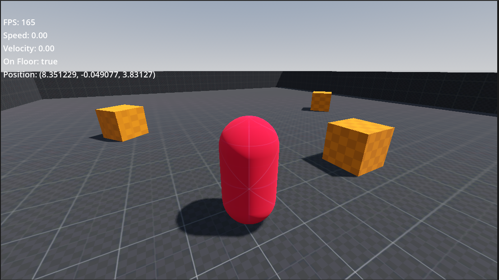

# Godot Character Controller

A simple first-person and third-person character controller built with **Godot 4** using **GDScript**.

This project serves as a foundation for FPS and TPS games by providing a clean and lightweight controller with smooth camera controls, multiple movement states, and a built-in debug overlay. It is designed to be easy to understand, modify, and extend for your own projects.

---

## Preview



---

## Features

### Character Movement

- Camera-relative movement
- Walk
- Jog
- Sprint
- Jumping
- Gravity and collision handling

### Camera

- Third-person camera
- First-person camera
- Smooth TPS ↔ FPS transition
- Mouse look
- Vertical camera angle clamping
- Automatic character mesh hiding in first-person mode

### Debug

- FPS counter
- Player speed
- Velocity
- Grounded state
- World position

---

## Controls

| Action | Key |
|--------|-----|
| Move | WASD |
| Jump | Space |
| Walk | Left Ctrl |
| Sprint | Left Shift |
| Toggle FPS / TPS | V |
| Release Mouse | Esc |

---

## Scene Structure

```text
World
├── WorldEnvironment
├── DirectionalLight3D
├── CSGComb3D
│   ├── CSGBox3D
│   ├── CSGBox3D2
│   ├── CSGBox3D3
│   ├── CSGBox3D4
│   └── CSGBox3D5
├── Player
│   ├── MeshInstance3D
│   ├── CollisionShape3D
│   └── CameraPivot
│       └── SpringArm3D
│           └── Camera3D
└── CanvasLayer
    └── DebugLabel
```

---


## About

This project is intended to be a clean starting point for anyone creating an FPS or TPS game in Godot 4. Development is ongoing, and new features will be added over time.

Contributions, suggestions, and feedback are always welcome.

---

## License

This project is licensed under the MIT License.